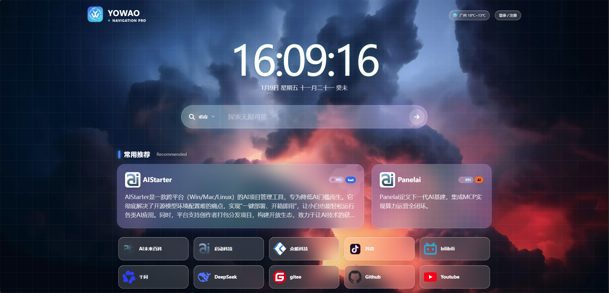

# Yowao Navigation Pro (Yowao Prism Navigation Theme)

> **Slogan:** Ultra-fast · Secure · High Aesthetic Appeal — A Geek Navigation Theme Built Specifically for Chinese Users.

**Yowao Navigation Pro** is a high-performance navigation theme developed based on WordPress. It features a unique "prism" visual style, integrates bank-level CSRF security protection, and has been deeply optimized for the domestic network environment (Google-free, Cravatar acceleration).

🎉 **Completely open source, no restrictions whatsoever!**
You can use, modify, distribute, or even remove the copyright information at the bottom freely and publish it as your own work.

## ✨ Core Features

* **🛡️ Ultimate Security**: Complete reconstruction of all site interfaces, introducing dynamic Nonce encryption verification to thoroughly prevent malicious registrations and interface attacks (403 protection).
* **🚀 Domestic Lightning Speed**:
    * **0 Latency**: Removal of all external dependencies such as Google Fonts/Icons.
    * **Ultra-fast Avatars**: Built-in domestic Cravatar mirror source to solve the Gravatar avatar broken image issue.
    * **Localized Resources**: Core JS/CSS libraries completely localized, avoiding CDN connectivity risks.
* **🎨 Prism Visuals**: iOS lock screen style oversized clock, 3D glass morphism cards, adaptive responsive layout.
* **⚡️ Smooth Experience**: Automatic login after successful registration, intelligent error popups, visual backend management sorting.

## 📥 Environment Preparation and Installation

### 1. Download WordPress (Chinese Version)
If you haven't built WordPress yet, please go to the official website to download the latest Chinese version:
👉 **[Click to download WordPress Chinese version](https://cn.wordpress.org/download/)**

### 2. Install Theme (Choose One)

#### Method A: WordPress Backend Installation (Recommended)
1.  Download the `.zip` theme package from this repository.
2.  Go to WordPress backend -> `Appearance` -> `Themes` -> `Add` -> `Upload Theme`.
3.  Select the uploaded file, install and click "Activate".

#### Method B: Direct Unzip and Upload
1.  Extract the downloaded package.
2.  Use an FTP tool or the file manager in BaoTa panel.
3.  Upload the extracted `yowao-theme` folder to the server's `/wp-content/themes/` directory.
4.  Go to WordPress backend -> `Appearance` -> `Themes`, find the theme and activate it.

> **🔴 Important Note (Mandatory):**
> After enabling the theme, you must go to the backend **`Settings` -> `Permalinks`** page, **without modifying any options, simply click the "Save Changes" button once**.
> *(This step is to refresh the pseudo-static rules to prevent new "URLs" and "Bookmarks" from having 404 errors)*

## 📧 Email Function Configuration (Important)

This theme supports **"Email Verification Registration"** and **"Password Recovery"** features. To ensure emails can be sent successfully, you must configure SMTP.

**Recommended Solution: Use the `WP Mail SMTP` plugin**

1.  In WordPress backend -> `Plugins` -> `Install Plugins`, search for **WP Mail SMTP** and install and enable it.
2.  Enter the plugin setup wizard, select your email service provider (such as QQ Mail, NetEase Mail, Gmail, or other SMTP).
3.  **Configure Key Information** (using QQ Mail as an example):
    * **SMTP Host**: `smtp.qq.com`
    * **Encryption**: `SSL` / Port `465`
    * **Username**: Your complete QQ email address
    * **Password**: **Note! You cannot enter your QQ login password here; you must go to the QQ Mail web version settings to enable SMTP and obtain the "Authorization Code".**
4.  After configuration, use the plugin's built-in "Send Test Email" function to ensure you can receive emails.

*After configuring SMTP, the theme's registration verification code function will work properly.*

## 🖼️ How to Customize Background Wallpaper

To avoid copyright disputes, this theme package **does not include** local wallpaper files by default (it will automatically load an online copyright-free image from Unsplash by default).

**If you want to use your own wallpaper, please follow these steps:**

1.  Prepare your favorite wallpaper image (recommended size 1920x1080 or higher).
2.  Upload the image file (supports `.jpg`, [.png](file://c:\Users\znkj-lwx\Desktop\yowao\yowao-theme\screenshot.png), `.webp`) to the **`assets/img/bg/`** directory under the theme folder.
    * **Path example**: `/wp-content/themes/yowao-theme/assets/img/bg/`
3.  **Mission accomplished!** Refresh the homepage, and the theme will automatically detect all images in this folder and randomly display one each time you refresh.

## ⚙️ Usage Instructions

* **Adding URLs**: In the backend left menu `URL Navigation` -> `Add URL`. The first two URLs in the list will automatically be displayed as "Wide Cards", with subsequent ones displayed as "Standard Icons".
* **Drag-and-Drop Sorting**: In the backend list page, you can sort by "Type" or "Likes".
* **Theme Settings**: In the `Theme Settings` menu, you can configure SEO, filing number, Logo, and enable/disable email verification registration.
* **Private Bookmarks**: After users log in, the "My Favorites" area will appear on the front end, where they can add private links visible only to themselves.

## ⚠️ Notes

1.  **Environment Requirements**: It is recommended to use PHP 7.4 or PHP 8.0+ for optimal performance.
2.  **File Permissions**: Please ensure that the `/wp-content/uploads/` directory has write permissions (for caching Favicon icons and weather data).

## 📜 Open Source License & Statement

The code of this project is open source under the **GPL v3** license (to be compatible with the WordPress ecosystem).

However, in the author's subjective intention, **no rights are reserved**:
* ✅ Allows personal or commercial free use.
* ✅ Allows secondary development and redistribution.
* ✅ **Allows removal of author credits at the bottom of the theme and in the code**.

*Hope this theme can help more people who need to build navigation sites!*